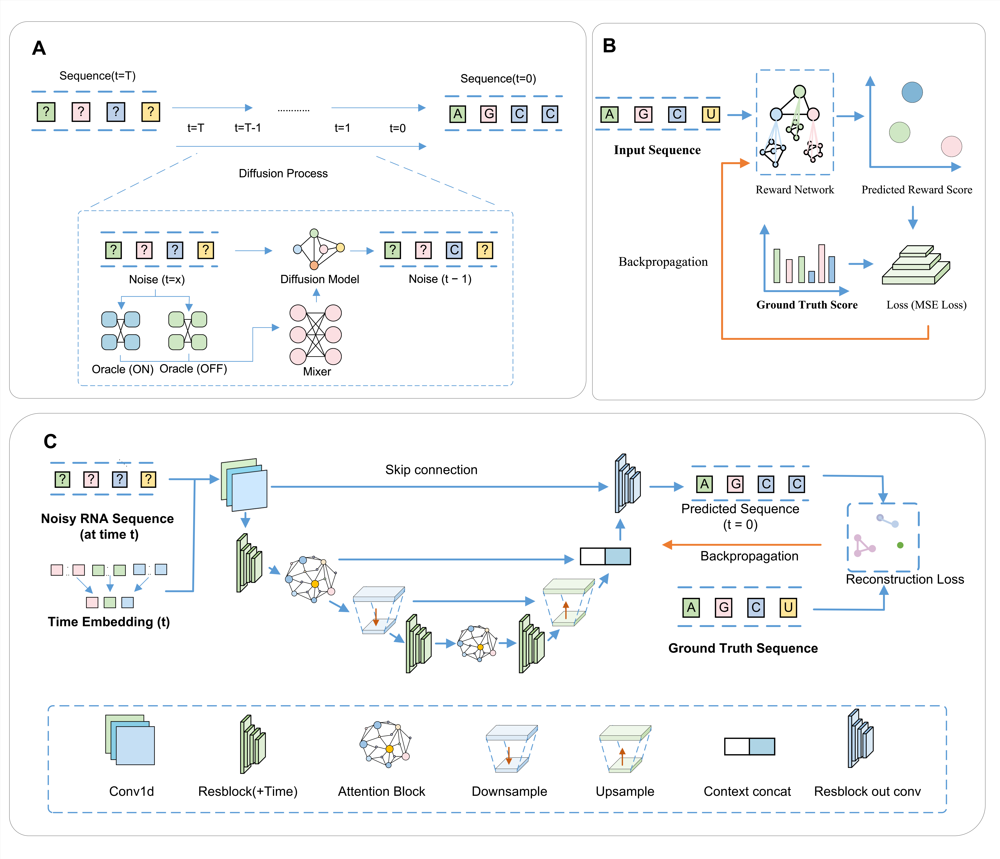

<p align="center">
  
</p>

---

## Installation

### Requirements

- Python 3.8+
- CUDA-capable GPU (recommended for training)

### Setup

```bash
git clone https://github.com/wangkeyao45-stack/RNADGG.git
cd RNADGG
pip install -r requirements.txt
```

For GPU support, install PyTorch with the appropriate CUDA version from [pytorch.org](https://pytorch.org/get-started/locally/), then install the rest:

```bash
pip install -r requirements.txt
```

---

## Data

This repository contains **three datasets/tasks** used by the RNADGG experiments:

- **5′ UTR (MPRA ribosome loading / translation)**  
  - Paper: [Sample et al., Nat Biotech 2019](https://doi.org/10.1038/s41587-019-0164-5)  
  - Original code/data reference: `https://github.com/pjsample/human_5utr_modeling`

- **Ribosome Binding Site (RBS)**  
  - Paper: [SAPIEN (BorgwardtLab)](https://doi.org/10.1038/s41467-020-17222-4)  
  - Original code/data reference: `https://github.com/BorgwardtLab/SAPIEN`

- **Toehold switches**  
  - Paper: [CL-RNA-SynthBio](https://doi.org/10.1038/s41467-020-18677-1)  
  - Original code/data reference: `https://github.com/yangmingshan/CL_RNA_SynthBio`

### Files in this repo

Processed CSVs are stored under `Data/`:

- `Data/raw/GSM3130443_designed_library.csv` (raw UTR library)
- `Data/processed/processed_data.csv`
- `Data/processed/rbs_data.csv`, `Data/processed/rbs_data_f.csv`
- `Data/processed/utr_data.csv`
- `Data/processed/toehold_data.csv`, `Data/processed/toehold_data_f.csv`

If you want to reproduce the raw UTR dataset from GEO:

- **GEO accession:** [GSE114002](https://www.ncbi.nlm.nih.gov/geo/query/acc.cgi?acc=GSE114002)

---

## Project Structure

```
RNADGG/
├── Codes/                   # Scripts (experiments / analysis / preprocessing)
├── Data/                    # Data (raw / processed)
├── model/                   # Model checkpoints (optional)
├── Model_results/           # Outputs (optional)
├── submit/                  # Submission artifacts (optional)
├── graphic_abstract_01.png
├── requirements.txt
└── README.md
```

---

---

## Quick Start

### 1. Preprocess data (if needed)

```bash
python Codes/preprocess/preprocess_utr_data.py
```

### 2. Run main experiments

**RNN-GAN + RL (full pipeline):**

```bash
python Codes/experiments/rnn_gan/experiment_rnn_gan_rl_unified.py
```

**Diffusion + RL (full pipeline):**

```bash
python Codes/experiments/diffusion/experiment_diffusion_rl_unified.py
```

**RBS diffusion with GA comparison:**

```bash
python Codes/experiments/rbs/experiment_rbs_diffusion_ga_comparison.py
```

### 3. Hyperparameter search (optional)

```bash
python Codes/search/search_oracle_hyperparams.py        # Oracle CNN
python Codes/search/search_diffusion_hyperparams_v1.py  # Diffusion model
```

See `Codes/README.md` for a full list of scripts and their purposes.

---

## Citation

```bibtex
@article{sample2019human,
  title={Human 5′ UTR design and variant effect prediction from a massively parallel translation assay},
  author={Sample, Peter J and Wang, Bin and Reid, Daniel W and Presnyak, Vladimir and McFadyen, Ian J and Morris, David R and Seelig, Georg},
  journal={Nature Biotechnology},
  volume={37},
  number={7},
  pages={803--809},
  year={2019},
  publisher={Nature Publishing Group}
}
```

---

## License

GNU General Public License v3.0. See [LICENSE](LICENSE) for details.
