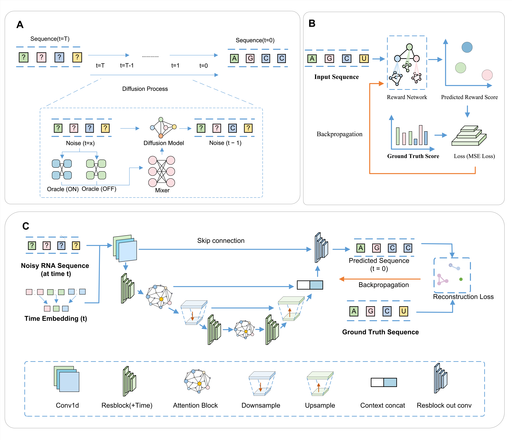

# RNADGG

Gradient-guided diffusion for functional regulatory RNA sequence design.

RNADGG combines a diffusion sequence generator with assay-trained sequence-to-function predictors, referred to as Oracles, to guide regulatory RNA sequence generation toward desired reporter-assay readouts. This repository provides a cleaned code release for the RNADGG manuscript, including reusable core modules, lightweight command-line utilities and archived standalone experiment scripts.

<p align="center">
  
</p>

## What is in this release

```text
RNADGG/
  rnadgg/       Reusable Python package: sequence utilities, models, data loading and diffusion helpers
  scripts/      Small command-line utilities for smoke tests and dataset inspection
  configs/      Example experiment configuration files
  data/         Local data directory, not tracked by git
  models/       Local checkpoints, not tracked by git
  results/      Local generated outputs, not tracked by git
  docs/         Data, reproducibility and code-organization notes
```

The `rnadgg/` package is the clean entry point for new use. Historical standalone scripts were moved out of the upload-ready tree and kept as a local backup, because many were one-off development scripts with duplicated code and inconsistent console text.

## Installation

Python 3.8 or newer is recommended. A CUDA-capable GPU is recommended for full training, although the smoke test can run on CPU.

```bash
git clone https://github.com/wangkeyao45-stack/RNADGG.git
cd RNADGG
python -m venv .venv
source .venv/bin/activate
pip install -e .
```

On Windows PowerShell, use:

```powershell
python -m venv .venv
.\.venv\Scripts\Activate.ps1
pip install -e .
```

For CUDA-enabled PyTorch, install the appropriate PyTorch build from the official PyTorch instructions before installing the package.

## Quick checks

Run the package smoke test:

```bash
python -m rnadgg.smoke
```

or:

```bash
python scripts/run_smoke_test.py
```

Inspect a dataset after placing it under `data/processed/`:

```bash
python scripts/inspect_dataset.py data/processed/rbs_data.csv --label-column rl
```

## Data

Full CSV datasets are not tracked in git. Place the processed files below under `data/processed/` before running full experiments:

```text
rbs_data.csv
rbs_data_f.csv
utr_data.csv
toehold_data.csv
toehold_data_f.csv
```

The raw 5-prime UTR library can be placed at:

```text
data/raw/GSM3130443_designed_library.csv
```

See [docs/DATA.md](docs/DATA.md) for dataset provenance.

## Running a compact RBS workflow

The reusable modules in `rnadgg/` cover shared building blocks: sequence encoding, Oracles, the 1D U-Net denoiser and a minimal guided diffusion wrapper. A compact parameterized RBS workflow is provided as:

```bash
python scripts/run_diffusion_rbs.py \
  --data data/processed/rbs_data.csv \
  --label-column rl \
  --guidance-scale 1.0 \
  --output-dir results/rbs_diffusion_g1
```

This script replaces several historical RBS scripts that differed mainly in guidance scale and output directory.

## Manuscript-style runs

Full manuscript reproduction also depends on exact generated sequence libraries, benchmark tables and model checkpoints. These files should be distributed through an external archive with a DOI rather than committed to GitHub. The current repository is organized as a clean code release, with generated data and checkpoints excluded from git.

For local reference, the original standalone development scripts are backed up outside this upload directory at:

```bash
C:/Users/Admin/Documents/Codex/2026-06-17/rnadgg/outputs/github_ready/RNADGG_legacy_standalone_scripts_backup
```

See [docs/REPRODUCIBILITY.md](docs/REPRODUCIBILITY.md) for details.

## Output policy

Generated checkpoints, logs, figures and sequence libraries should be written to `models/` or `results/`. These directories are intentionally ignored by git. For publication-level reproducibility, archive generated sequence libraries and benchmark tables in a data repository such as Zenodo, Figshare, OSF or an institutional repository.

## Citation

If you use this code, please cite the associated RNADGG manuscript and the original dataset papers listed in [CITATION.cff](CITATION.cff).

## License

This repository is released under the GNU General Public License v3.0. See [LICENSE](LICENSE).
